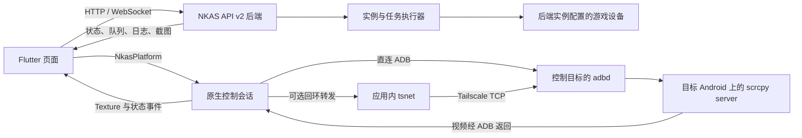
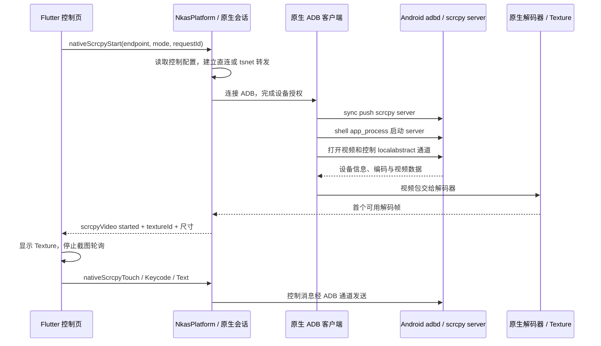
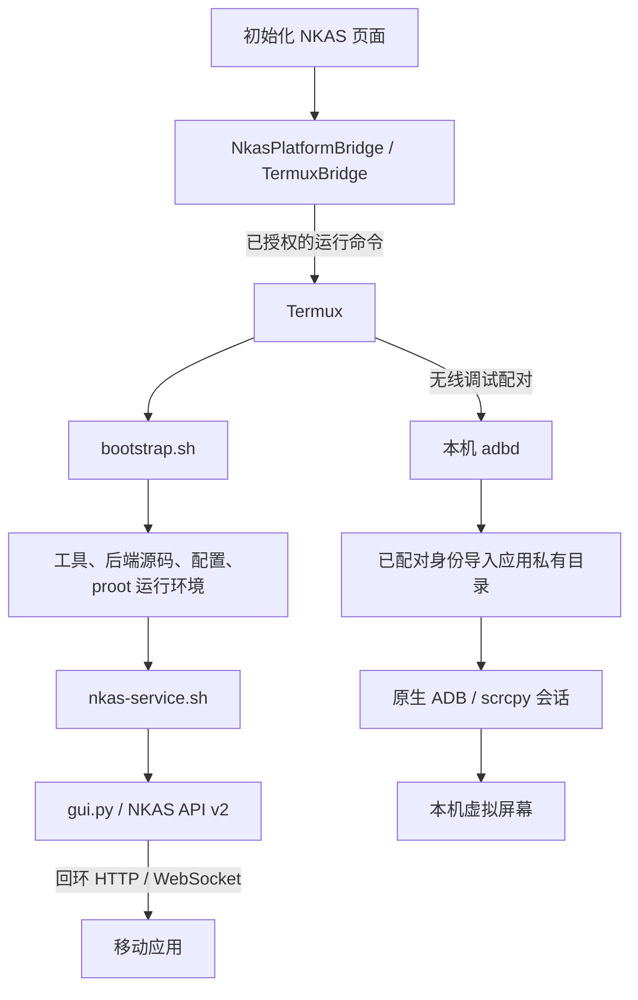

# 项目结构与执行流程

本文描述仓库当前实现的模块职责和运行链路。配置步骤见[连接与使用](USAGE.md)，编译和交付见[构建与发布](../BUILD.md)。

## 系统边界

NKAS Mobile 有两条独立的业务链路：后端负责自动化任务、配置、调度与日志；原生控制客户端负责 Android 的实时画面与人工输入。后端可以运行在远程主机，也可以运行在 Android 本机的 Termux 环境中。



“后端地址”选择 HTTP/WebSocket 服务，“控制连接”选择接受 ADB 操作的 Android 设备。两者可以在同一台机器，也可以分开部署。控制目标按“实例覆盖地址 → 实例后端配置的 `Emulator.Emulator.Serial`（空或 `auto` 视为未配置）”解析，本机手填的固定地址仅在后端实例列表不可用时兜底；切换实例按新实例重新解析，但不改写已保存的地址。后端的 PC 自动化能力不意味着移动端 scrcpy 可以控制 PC 桌面。

应用内 tsnet 仅为原生控制提供 TCP 转发，后端流量仍使用系统网络。视频和触摸不经过 NKAS 后端，也不通过 WebView、VNC 或 `ws-scrcpy` 中转。

## 目录与模块

| 路径 | 职责 |
| --- | --- |
| [lib/main.dart](../lib/main.dart)、[lib/app](../lib/app/) | 注册许可证、创建应用与连接控制器、导航、实例选择与全局订阅。壳层切换根页面（总览/实例/任务/控制/日志/设置），设置等子页面走真实路由 push，由系统转场提供 iOS 左边缘侧滑返回与 Android 返回 pop |
| [lib/features](../lib/features/) | 总览、实例、任务、控制、日志、部署、初始化和设置页面 |
| [lib/core/api](../lib/core/api/) | API 请求、入口凭据附加、响应解析与数据模型 |
| [lib/core/connection](../lib/core/connection/) | 后端连接、授权恢复、状态/队列/日志 WebSocket |
| [lib/core/settings](../lib/core/settings/) | 后端根地址与安全入口凭据存储 |
| [lib/core/platform](../lib/core/platform/) | `NkasPlatform`、控制设置、平台事件和能力判断 |
| [lib/core/widgets](../lib/core/widgets/)、[lib/theme.dart](../lib/theme.dart) | 共享组件与主题 |
| [android/app/src/main/kotlin](../android/app/src/main/kotlin/) | Android 平台桥、Termux 集成、ADB、scrcpy、MediaCodec、前台服务 |
| [ios/Runner](../ios/Runner/) | iOS 平台桥、嵌入式 ADB、scrcpy、VideoToolbox、Texture |
| [native/tsnet](../native/tsnet/) | Go 绑定和移动端 Tailscale 转发核心 |
| [native/adb](../native/adb/) | iOS ADB 嵌入补丁、CMake 输入与链接检查 |
| [tool](../tool/) | 原生构建、资源核查、许可证与版本工具 |

## 应用启动与后端连接

1. `main()` 注册原生依赖许可证，启动 `NkasMobileApp`。
2. 应用创建 `ApiClient`、`ConnectionController`、普通地址存储和安全凭据存储；Android 另外提供本机 Termux 入口加载器。
3. `ConnectionController.initialize()` 读取已保存地址和凭据，默认后端为 `http://127.0.0.1:12271`，请求 `GET /api/system/status`。
4. 状态响应中的 `security_entry.authorized` 决定安全入口是否有效，`api_version` 必须为 2。HTTP 200 本身不代表授权成功；连接结果区分已连接、已断开与版本不兼容。
5. `NkasShell` 结合 STAR 访问状态和后端状态加载实例、建立订阅，并把当前实例的数据交给页面。STAR 未通过时不启动业务订阅和画面轮询。

连接尝试用 generation 标识，地址或凭据改变时旧响应不会覆盖新连接。普通设置只持久化根地址，安全入口通过独立存储维护。

### HTTP 与 WebSocket

页面通过 `ConnectionController` 调用 `ApiClient`，实例名作为路径片段进行编码。下表中的 `{name}` 表示后端实例名。

| 数据或操作 | 路径 |
| --- | --- |
| 后端能力和授权状态 | `GET /api/system/status` |
| 实例列表 / 启停 | `GET /api/instances`、`POST /api/{name}/start`、`POST /api/{name}/stop` |
| 队列、调度与任务配置 | `/api/{name}/queue`、`/schedule`、`/schedule/save`、`/schedule/reset`、`/schema`、`/config` |
| 截图 | `GET /api/{name}/screenshot` |
| 活动日历 / 历史日志 | `/api/calendar`、`/api/system/logs/files`、`/api/system/logs`、`/api/system/logs/download` |
| 部署 / 后端更新 | `/api/system/deploy`、`/api/system/deploy/reset`、`/api/system/update`、`/api/update/check`、`/api/update` |
| 安全入口读取 / 轮换 | `/api/security/entry`、`/api/security/entry/regenerate` |
| 实例状态推送 | `/ws/state` |
| 所选实例的队列 / 实时日志 | `/ws/{name}/queue`、`/ws/{name}/log` |

队列、调度与任务配置行中省略前缀的路径均接在 `/api/{name}` 后。API v2 是状态接口声明的协议版本，URL 不额外包含 `/v2`。

任务启动请求送到后端后，由后端按自身配置执行自动化并推送状态、队列和日志；移动端显示服务端结果。普通配置编辑通过 HTTP 提交，实时变化通过 WebSocket 更新。状态与队列订阅由壳层管理，日志订阅随相应页面管理；切换连接、实例或凭据时关闭旧订阅，断线后在连接条件满足时重试。

`https` 后端使用 `wss`，`http` 使用 `ws`。Android/iOS WebSocket 握手携带与 API 一致的 Bearer 凭据；后端更新、日志和部署功能不依赖 scrcpy 会话。

### 安全入口与凭据作用域

`BackendAddress` 将完整 `/entry/<key>` 地址拆为根地址和密钥。`EntryHttpClient` 只对匹配后端协议、主机、端口及路径范围的请求加 `Authorization: Bearer <key>`，携带密钥的请求不自动跟随重定向。图片和下载也使用该作用域规则。

收到未授权响应或订阅断开时，连接层复核入口状态。Android 本机部署可通过已授权的 Termux 命令重读 `config/.security/entry.key`；远程配置要求用户填写新入口，不借用本机凭据。手动输入回环地址同样按远程配置处理。

密钥轮换更新安全存储和 credential revision，驱动旧订阅关闭、按新凭据连接。根地址与凭据分开保存，Android 使用加密存储并排除备份，iOS 使用仅限本设备的 Keychain。

## scrcpy 实时控制链路

### 启动和首帧



[screen_page.dart](../lib/features/screen/screen_page.dart) 为每次连接生成 `requestId`，读取独立控制配置，再调用 `NkasPlatform.nativeScrcpyStart()`。页面默认请求 H.264、最大尺寸 1920、码率 8 Mbps，音频关闭。原生协议层支持 H.264 / H.265，实际解码能力由设备决定。

原生会话完成以下工作：

1. 停止旧会话，建立 ADB 直连或 Tailscale 回环转发；本机虚拟屏幕模式先导入已配对的本机身份。
2. 经 ADB sync 推送应用携带的 scrcpy server 4.1 到目标 `/data/local/tmp/`，再用 `app_process` 启动。
3. 为本次会话生成 `scid`，通过 ADB 打开 `localabstract:scrcpy_<scid>` 流。`tunnel_forward=true` 模式下，视频和控制使用各自通道，不对外新增独立视频端口。
4. 读取设备名和编码元数据，解析视频尺寸、配置包和帧包，交给原生解码器。
5. 首帧到达才发送 `scrcpyVideo/started`。方法返回或 Texture ID 分配成功均不等于已经出图；首帧等待有超时处理。

原生视频缓冲直接交给 Flutter Texture，帧像素不逐帧穿过 Dart MethodChannel。Dart 接收纹理编号、尺寸和状态，用于显示和坐标映射。

### Android 与 iOS 的实现差异

| 层 | Android | iOS |
| --- | --- | --- |
| 会话管理 | `NativeControlSession.kt` | `NkasNativeSession.swift` |
| ADB | Kotlin `NativeAdbClient` 直接连接目标，处理 CNXN/AUTH/STLS、流复用与流控 | `NkasIosAdbClient` 通过本机 smart socket 调用嵌入式 `adb-mobile`，由其管理设备传输与 RSA/TLS |
| 本地运行时 | 应用内 Kotlin ADB 客户端 | `NkasAdbRuntime` 启动进程级 ADB server，仅监听回环临时端口 |
| 视频 | `NativeScrcpySession` → MediaCodec → Surface / Texture | `NkasIosScrcpySession` → VideoToolbox → CVPixelBuffer / FlutterTexture |
| 输入 | `ScrcpyControlWriter` | `NkasIosScrcpyControl` |
| 本机模式 | 支持 Termux 配对身份与虚拟屏幕 | 仅支持远程 Android |

iOS 的本地 ADB smart-socket 端口与 tsnet 转发端口是两个不同用途的监听器：前者服务应用内 ADB 调用，后者通向远端 adbd。ADB server 是进程级单例，不随每次视频重连重复启动；结束会话会关闭相应设备连接和通道。

### 输入流程

[NativeVideoSurface](../lib/features/screen/native_video_surface.dart) 根据显示区域映射目标像素坐标，并限制在视频边界内。它跟踪一个活动指针，按顺序发送按下、移动、抬起或取消；连续移动可合并，长按保留按下状态直到抬起。尺寸变化、页面销毁或应用退后台时释放活动手势。

触摸、按键和文本通过平台桥传入原生控制写入器，编码为 scrcpy 控制消息，经 ADB 控制通道送到目标。返回和主页对应系统按键。文本限制为 300 UTF-8 字节；编码成功不表示所有输入法或应用都能接受全部 Unicode 字符。

### 平台契约与生命周期

`NkasPlatform` 使用 MethodChannel `com.megumiss.nkas/platform` 发出操作，EventChannel `com.megumiss.nkas/platform_events` 回传状态。

| 接口组 | 主要操作 |
| --- | --- |
| 控制配置 | `getNativeControlSettings`、`saveNativeControlSettings` |
| Tailscale | `tsnetConfigure`、`tsnetConnect`、`tsnetStatus`、`tsnetStartForward`、`tsnetStopForward`、`tsnetStopAll`、`tsnetClose`、`tsnetClearState` |
| ADB | `nativeAdbConnect`、`nativeAdbShell`、`nativeAdbPush`、`nativeAdbPull`、`nativeAdbClose` |
| 视频与输入 | `nativeScrcpyStart`、`nativeScrcpyStop`、`nativeScrcpyTouch`、`nativeScrcpyBack`、`nativeScrcpyKeycode`、`nativeScrcpyText` |

`scrcpyVideo` 事件携带 `requestId` 和 `connecting`、`size`、`started`、`waiting`、`failed`、`stopped` 等状态。Flutter 过滤旧 requestId，原生层用 generation 取消过期工作；带旧 requestId 的停止操作不会终止新会话。

| 触发条件 | 行为 |
| --- | --- |
| 进入控制页 | 有访问权限时先获取后端截图，用户点击后才启动原生控制 |
| 首帧到达 | 显示 Texture，停止两秒截图轮询 |
| 停止、失败或等待恢复 | 清除旧 Texture，恢复截图请求；后端不可达时显示错误或空态 |
| 主动断开、关闭承载控制的转发 | 清除连接意图，释放视频、输入、ADB 与相应转发，取消自动重连 |
| 远程网络变化 | 关闭旧会话，在前台且网络可用时重建；连续失败最多自动重试三次 |
| Android 进入后台 | 活动控制由前台服务维持；后台断线后回前台恢复 |
| iOS 进入后台 | 停止视频与转发，回前台按保留的连接意图重建 |

## Tailscale 转发

`NativeTsnet` / `NkasTsnetClient` 通过 gomobile 绑定调用 `native/tsnet/bridge.go`，再进入 `forwarder`。链路为：

```text
原生 ADB 的设备连接
  → 127.0.0.1:<系统分配的临时端口>
  → Go forwarder 双向复制 TCP 数据
  → tsnet.Server.Dial
  → Tailscale IP / MagicDNS / 已批准子网路由中的目标:ADB端口
```

监听固定在 `127.0.0.1`，`localPort: 0` 由系统分配端口。远端支持 IPv4、IPv6 与 MagicDNS；注册成功后仍需满足目标网络路由、tailnet ACL 和 ADB 授权。

AuthKey 只用于内存中的注册配置，长期节点状态保存在应用私有目录并排除备份。`StopForward` 停指定转发，`StopAll` 停全部转发并保留 tsnet 实例，`Close` 另关闭实例；清除身份会先中断连接和转发，再删除节点状态。Android 适配层把系统网络接口和默认接口传给 Go，供其选择可用网络。

## Android 本机部署与虚拟屏幕



`bootstrap.sh` 准备 Termux 工具、同步 `NIKKEAutoScript` 后端源码、创建配置、用 proot-distro 安装运行环境，再调用 `nkas-service.sh`。后者以 `gui.py --host ... --port ...` 启动后端；使用的是 proot 用户态环境，不需要启动 Docker daemon。

后端源码位于 Termux 的 `$HOME/NIKKEAutoScript`，绑定到运行环境的 `/app/NIKKEAutoScript`。服务参数来自 `$HOME/.nkas/settings.env`，默认监听 `127.0.0.1:12271`；这些启动参数决定实际监听，不能仅靠修改部署页字段改变。

初始化页通过命令回执、脚本状态和日志了解进度，回调超时不等于脚本退出；已有安装进程时接续查询，真实脚本失败才进入重试。运行状态文件位于 Termux 的 `$HOME/.nkas/`。

无线调试配对后，原生 ADB 导入配对身份到独立的 `native-adb/local` 目录，连接本机回环调试端口。scrcpy 使用 `new_display=1080x1920/320` 和 `vd_destroy_content=false` 请求虚拟屏幕。该模式不经过 tsnet，Termux 负责部署与配对，视频解码和输入仍由应用内原生代码处理。

## 授权与故障边界

| 授权或连接 | 负责的范围 | 不能替代 |
| --- | --- | --- |
| STAR 验证 | 浏览器 OAuth 返回许可，应用校验签名、仓库和有效期，控制客户端功能入口 | 后端安全入口、Tailscale 或 ADB 授权 |
| 后端安全入口 | 后端 API、截图、资源和 WebSocket 访问 | 原生设备控制权限 |
| Tailscale 节点与 ACL | 应用内转发到目标网络的可达性 | 设备的 ADB 身份授权 |
| ADB 授权 | 在目标 Android 上启动 scrcpy 和发送输入 | 后端实例权限或任务状态 |

诊断应按失败的链路定位：任务、配置、日志或截图错误查后端；实时画面与触摸错误查原生会话、ADB 和可选 tsnet；本机初始化错误查 Termux 命令、脚本状态和后端服务。可复用的验证步骤见[设备验收](VALIDATION.md)。
